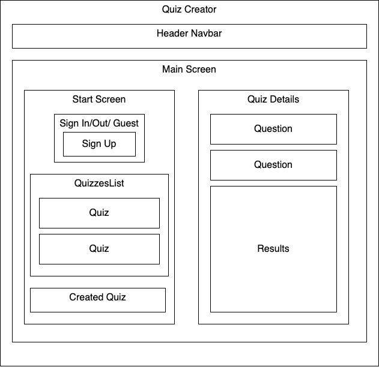

# _Quiz Maker_

#### _React week 3 React with NoSQL Practice Project for Epicodus Bootcamp_

#### Created By: **Christina Welch, Michael Watkins, & Christopher Neal**

## Technologies Used

- _HTML_
- _CSS_
- _Javascript_
- _React_
- _npm_
- _Babel_
- _Firebase_
- _Firebase Authentication_
- _Firestore_
- _React Redux Firebase_
- _Styled Components_

## Description

_This project was created for Epicodus bootcamp to show proficiency in React with NoSQL. The application is for a user to log in and create and take quizzes. The user has full CRUD functionality on the quizzes._

## Project Layout Diagram

## Setup/Installation Requirements

- _React version 3.2.0_

### Basic Setup

- Clone the GitHub repository: [https://github.com/christophermneal/quiz-with-firestore](https://github.com/christophermneal/quiz-with-firestore)
- From the main project directory, run `npm install` in the terminal to load necessary plugins and packages.
- Run `npm run start` to start the application.

## Known Bugs

_None at this time_

## License

_[MIT](https://opensource.org/licenses/MIT)_
Copyright (c) _2022_ _Christina Welch, Michael Watkins, and Christopher Neal_

## Support and Contact Details

- _[christopher.m.neal@gmail.com](mailto:christopher.m.neal@gmail.com)_
